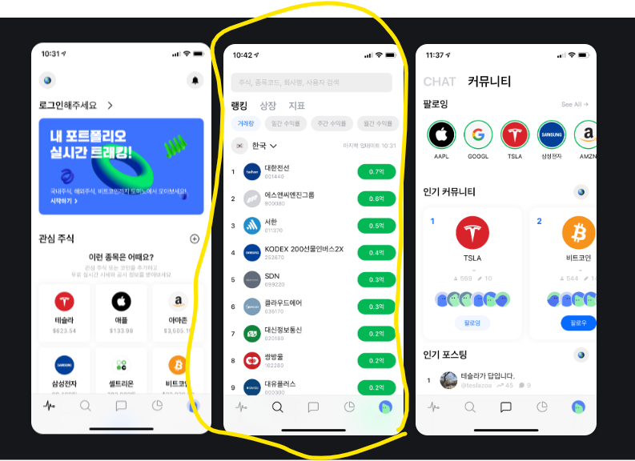

# MyFirstMAUIApp

안드로이드랑 윈도우(데스크탑)에서 동작하는 통신 학습용 앱  
MAUI랑 Figma 공부하려고 만든 개인 프로젝트, 시리얼 통신 + Modbus 기능 끝

## 목표
- MAUI로 Android + Windows 크로스플랫폼 UI 구현
- Figma로 화면 설계 및 프로토타입 제작 연습
- 시리얼 통신 터미널 기능 구현
- Modbus(RTU) 통신 기능 추가

# 디자인 구현 중. 

  
   
  
   
  
   
  

## 현재 상태
- 프로젝트 초기 단계
- Modbus 기능 추가  (코어 로직 일부 구현 modbus func 03,04,06 구현)   
- UI(뷰) 구현 , 다크 or 화이트 테마 구현
- 앱 구조와 통신 백엔드 설계 완료   
- 데이터 로그 기능

## 앱 레이아웃 
하단 고정 버튼(탭바)으로 화면 전환
- Main (메인)
- Serial Terminal (시리얼 터미널)
- Modbus (모드버스)
- Settings (설정)
- Info (정보)

## 주요 기능
**시리얼 통신 터미널**
- 포트 스캔 / 선택   
- 보드레이트, 데이터 비트, 패리티, 정지비트 설정
- 수신/송신 로그 보기

**Modbus**
- Modbus RTU / TCP 지원 예정
- 읽기/쓰기 요청 전송 (구현 중) 

**설정**
- 기본 통신 설정 저장
- UI/테마 설정

**정보**
- 앱 버전, 개발자 정보, 라이선스

## 빌드 방법
**사전 준비**
- .NET 7/8 이상
- Visual Studio 2022/2023 (MAUI workload)
- Android SDK, 에뮬레이터 또는 실제 기기
- Windows 10/11

## TODO
기능
- [x] Serial 통신 기본 구현 
-  [x] Modbus 요청/응답 처리 완성 (RTU, T) 

디자인 
-  [x] 하단 탭바 구현 및 화면 연결
-  [x] 디자인 완성및, 아이콘 등등 세부 구현

다국어
-  [ ] 한국어, 영어, 일본어 분리

알림

-  [ ] 로그 기록및 ,알림구현 (csv 아웃풋은 윈도우만 기능됨)
